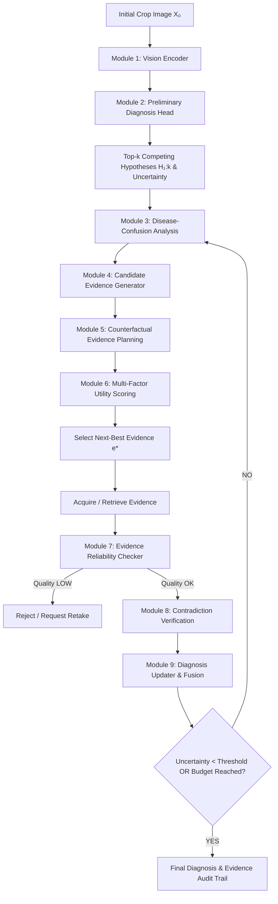

# EvidenceGain-X

> **Counterfactual, Self-Verifying Next-Best Evidence Acquisition for Crop Disease Diagnosis**

[](https://www.python.org/downloads/)
[](https://pytorch.org/)
[](LICENSE)
[](https://streamlit.io/)

---

## 📌 Executive Summary

Conventional crop-disease AI models ask a single question: **"What disease is this?"**  
**EvidenceGain-X** transforms this paradigm by asking two fundamental questions:
1. *"What is the provisional diagnosis and what are the competing disease hypotheses?"*
2. *"What specific evidence should the system observe next to maximize diagnostic discrimination while minimizing acquisition cost and risk?"*

> **Final Project Statement**  
> EvidenceGain-X is not an AI that merely tells a farmer what disease a plant has. It is an AI that diagnoses the plant, recognizes when its current evidence is insufficient, decides what information would be most useful next, verifies that information, updates its diagnosis, and stops only when the available evidence is sufficient.

The final system is **both a diagnosis system and an evidence-acquisition system**. Diagnosis is a first-class output at the beginning and again after every evidence acquisition step.

---

## 💡 Why the Idea Is Different

| Conventional Approach | EvidenceGain-X |
| :--- | :--- |
| Fixed image $\rightarrow$ Disease | Initial image $\rightarrow$ Provisional diagnosis $\rightarrow$ Evidence acquisition $\rightarrow$ Final diagnosis |
| Top-1 prediction only | Competing disease hypotheses (Top-$k$) |
| Confidence treated as static output | Uncertainty directly drives active evidence selection |
| Assumes all modalities are present | Dynamically chooses which evidence to acquire |
| No explicit acquisition policy | Learned, disease-hypothesis-conditioned utility ranking |
| Blindly accepts corrupt/contradictory input | Quality checking & contradiction verification gating |
| Stops immediately after one forward pass | Adaptive stopping when uncertainty is sufficiently resolved |

---

## 🔄 Complete System Flow



---

## 🧩 The 9 Core Modules

1. **Module 1 — Initial Observation Encoder**: Pretrained visual backbone (ResNet-18 / EfficientNet / ConvNeXt) extracting rich morphological lesion embeddings, texture, and spatial symptom patterns.
2. **Module 2 — Preliminary Disease Diagnosis**: Temperature-calibrated classifier producing calibrated logits, softmax probabilities, Shannon entropy, and top-$k$ competing disease hypotheses.
3. **Module 3 — Disease-Confusion Analysis**: Analyzes specific pairwise confusion between rivals (e.g., *Early Blight* vs. *Late Blight*), switching the question from *"What confirms hypothesis A?"* to *"What separates hypothesis A from rival B?"*.
4. **Module 4 — Candidate Evidence Generator**: Enumerates candidate observations realistically available in field conditions (Lesion close-up, leaf underside, stem view, symptom text, environmental/weather context).
5. **Module 5 — Counterfactual Evidence Planning**: Estimates expected diagnostic shifts before observation without requiring generative hallucination.
6. **Module 6 — Multi-Factor Evidence Utility Network**: Balances diagnostic separation, uncertainty reduction, acquisition cost, and reliability risk.
7. **Module 7 — Evidence Reliability Checker**: Evaluates incoming evidence for image degradation (Laplacian blur score, over/underexposure, framing, and semantic relevance) before granting diagnostic weight.
8. **Module 8 — Contradiction Verification**: Compares acquired evidence with planned expectations to detect contradictory shifts and prevent false confidence.
9. **Module 9 — Diagnosis Updater & Adaptive Stopper**: Recalculates disease posterior distributions via multimodal fusion and decides whether to terminate or request further observations.

---

## 📐 Mathematical Formulation

Let $X_0$ be the initial crop observation, $D \in \mathcal{C}$ be the disease class, and $\mathcal{E}$ be the candidate evidence set.

### 1. Information Gain
$$\text{IG}(e \mid X_0) = H(D \mid X_0) - \mathbb{E}_{y \sim P(e \mid X_0)} [H(D \mid X_0, e=y)]$$

### 2. Multi-Objective Evidence Utility
$$\text{EvidenceUtility}(e) = \alpha \cdot \text{HypothesisSeparation}(e) + \beta \cdot \text{UncertaintyReduction}(e) + \gamma \cdot \text{ExpectedDiagnosticImprovement}(e) - \lambda \cdot \text{AcquisitionCost}(e) - \mu \cdot \text{EvidenceRisk}(e)$$

### 3. Optimal Evidence Selection Policy
$$e^* = \arg\max_{e \in \mathcal{E}} U(e \mid X_0, H_{1:k})$$

---

## 🧪 Experimental Baselines

EvidenceGain-X isolates the contribution of active evidence selection across 7 rigorous baselines:

| Baseline | Name | Acquisition Behavior |
| :--- | :--- | :--- |
| **B0** | Initial-Only | Single forward-pass diagnosis from $X_0$ (conventional standard) |
| **B1** | Random Policy | Uniformly selects random additional evidence from candidate set |
| **B2** | Fixed Order | Always acquires evidence in a hardcoded sequence |
| **B3** | Confidence-Driven | Requests evidence based on maximum predicted softmax confidence |
| **B4** | Uncertainty-Only | Selects evidence optimizing only entropy reduction $H(D)$ |
| **B5** | EvidenceGain | Learned neural utility selector without confusion/counterfactuals |
| **B6** | **EvidenceGain-X** | **Full framework**: Confusion-aware + Counterfactual planning + Reliability gating + Contradiction verification |

---

## 📊 Evaluation Metrics

- **Diagnostic Performance**: Top-1 Accuracy, Macro-F1, Top-$k$ Accuracy, Confusion Matrix.
- **Calibration**: Expected Calibration Error (ECE), Brier Score.
- **Acquisition Quality**: Mean Information Gain, Acquisition Rank Accuracy.
- **Efficiency**: Observations needed to reach target diagnostic confidence.
- **Self-Verification**: Contradiction detection rate, Low-quality evidence rejection rate.

---

## 🛡️ Data Strategy & Leakage Prevention

- **Constructed Evidence Episodes**: Formed from established public crop datasets (PlantVillage, PlantDoc, PlantInquiryVQA, DigiGreen) without requiring expensive field hardware or deliberate plant infections.
- **Strict Leakage-Safe Splitting**: Split by plant/case/source level rather than random image slicing to ensure zero near-duplicate contamination between train, val, and test partitions.
- **Target Crop Scope**: Primary focus on visually confusable Solanaceae diseases (*Early Blight*, *Late Blight*, *Septoria Leaf Spot*, *Healthy*).

---

## 📁 Repository Structure

```text
EvidenceGain-X/
├── configs/
│   └── config.yaml             # Master pipeline & hyperparameter configuration
├── data/
│   ├── manifests/              # Leakage-safe split metadata & episode definitions
│   ├── processed/              # Preprocessed multi-view episodes
│   └── raw/                    # Source image collections
├── src/
│   ├── data/                   # Dataset loaders, splitters, transforms, episode builders
│   ├── models/                 # Vision backbones, classifier heads, calibration
│   ├── diagnosis/              # Top-k hypotheses, confusion analyzer, posterior updater
│   ├── evidence/               # Candidate generators, utility scoring, ranking policy
│   ├── planning/               # Counterfactual evidence planner
│   ├── verification/           # Blur/lighting reliability gating & contradiction checks
│   ├── evaluation/             # Benchmark suites against B0-B6 baselines & ablations
│   └── utils/                  # Config parsers, logging, seed reproducibility
├── experiments/                # Experiment logs & run artifacts
├── checkpoints/                # Trained model weights (.pt)
├── results/                    # Benchmark tables, ablation results (.json, .csv)
├── demo/
│   └── app.py                  # Interactive Streamlit diagnosis & evidence demo
├── tests/                      # Automated unit & integration tests
└── scripts/
    ├── download_data.py        # Dataset setup & episode synthesis
    └── run_experiments.py      # Automated benchmark & ablation runner
```

---

## 🚀 Quickstart & Reproduction

### 1. Environment Setup

```bash
# Clone the repository
git clone https://github.com/KrSanib1544/EvidenseGain-X.git
cd EvidenseGain-X

# Create and activate virtual environment
python -m venv .venv
.venv\Scripts\activate   # On Linux/macOS: source .venv/bin/activate

# Install dependencies
pip install -r requirements.txt
```

### 2. Prepare Data & Build Episodes

```bash
python scripts/download_data.py
```

### 3. Run Experiments & Baselines (B0–B6)

```bash
python scripts/run_experiments.py
```

### 4. Run Automated Test Suite

```bash
pytest tests/ -v
```

### 5. Launch Interactive Streamlit Demo

```bash
streamlit run demo/app.py
```

---

## 🔍 Explainability & Trust Principles

- **Transparent Diagnostic Evolution**: Preliminary and updated diagnoses are tracked explicitly with probability trajectories.
- **Evidence Justification**: The system explains *why* a particular piece of evidence was recommended (which competing hypotheses it resolves).
- **Quality Gating**: Low-quality, dark, or blurry images are flagged with actionable retake suggestions rather than yielding erratic predictions.
- **Safe Failure Mode**: Emits an explicit *"Insufficient Evidence"* status when diagnostic uncertainty cannot be resolved within budget.

---

## 🔬 Research Questions Addressed

- **RQ1**: *Can a deep-learning system learn to select the next agricultural observation that most improves disease discrimination?*
- **RQ2**: *Does disease-confusion-aware selection outperform generic uncertainty-only selection?*
- **RQ3**: *Does counterfactual evidence utility improve acquisition efficiency?*
- **RQ4**: *Can evidence quality and contradiction verification reduce confidently incorrect diagnoses?*
- **RQ5**: *Can the system achieve target diagnostic quality using fewer observations than passive strategies?*

---

## 📜 Citation & License

This project is licensed under the MIT License. If you use EvidenceGain-X in your research, please cite:

```bibtex
@article{evidencegainx2026,
  title={EvidenceGain-X: Counterfactual, Self-Verifying Next-Best Evidence Acquisition for Crop Disease Diagnosis},
  author={Kumar Sanib},
  year={2026}
}
```
